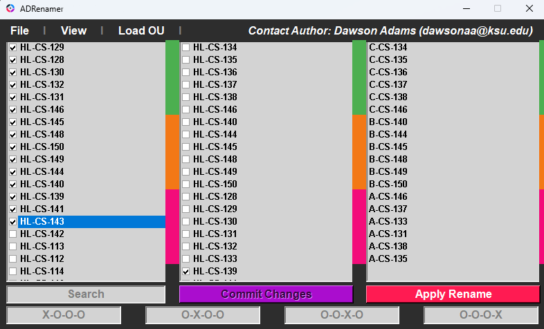
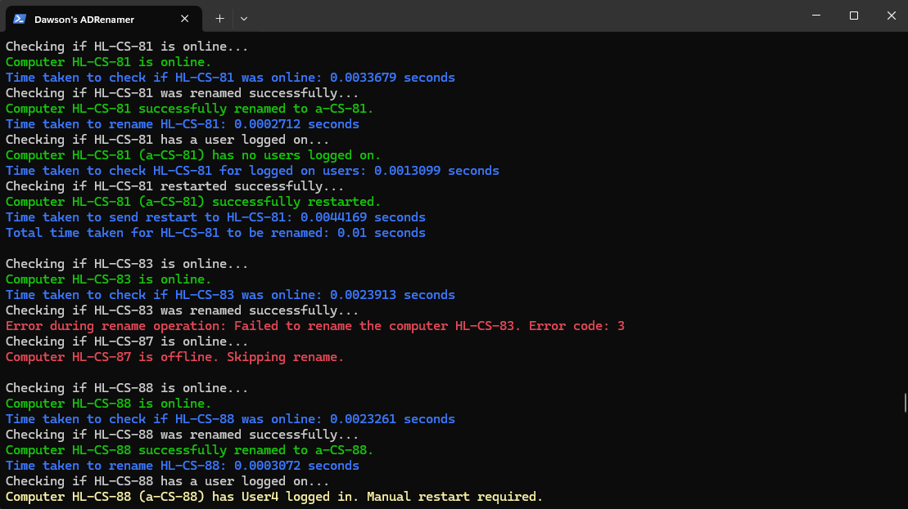
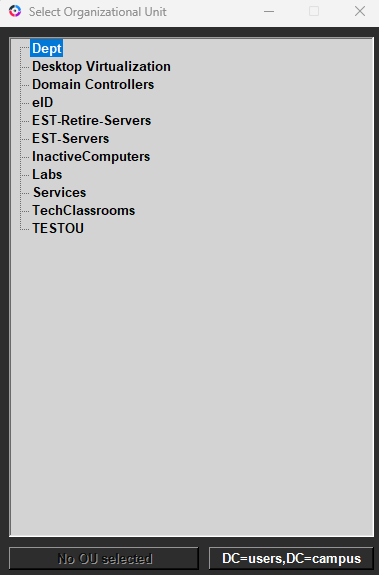
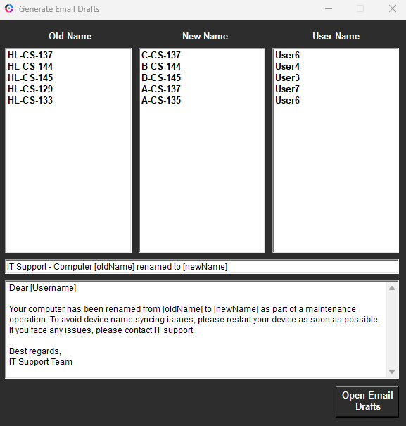
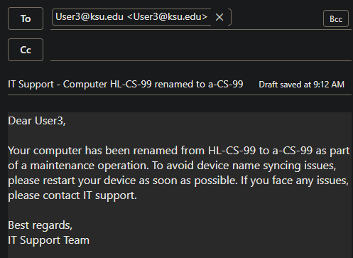
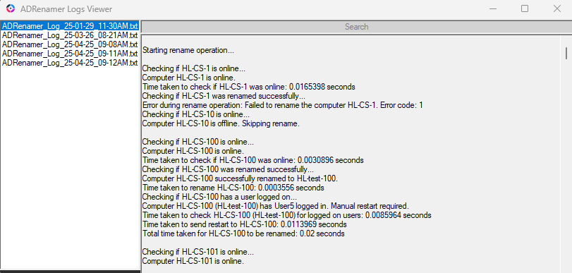
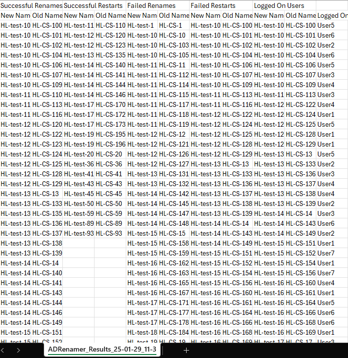

#   Dawson's ADRenamer   

## By Dawson Adams (dawsonaa@ksu.edu) at Kansas State University 

## Overview
PowerShell script for renaming Active Directory (AD) computer objects. It allows users to load and filter AD computer objects, rename them based on specified criteria, handle restarts, and log operations performed. It also supports email generation, color-coded terminal output, and integration with Power Automate for uploading logs to SharePoint.

## Main GUI

## Terminal

## Select OU

## Email Generation GUI
 

## Logs Viewer

## Results CSV

## Installation
1. **Download the Installer**: Download `DawsonADRenamerInstaller.exe` and run it (requires admin privileges).
2. **Script Location**: The script is located in `C:\Users\CurrentUser\Dawson's ADRenamer\Dawson's ADRenamer.ps1`.
3. **Shortcuts**: Shortcuts are added to `C:\Users\CurrentUser\Desktop` and `C:\Users\CurrentUser\AppData\Roaming\Microsoft\Windows\Start Menu\Programs\Dawson's ADRenamer`.

## Running the Script
- **Via Shortcut**: Search for "Dawson's ADRenamer" in Windows and open the shortcut. This shortcut uses `Set-ExecutionPolicy` to bypass script warnings.
- **Via PowerShell**: Right-click the script file and select "Run with PowerShell". If permission issues occur, right-click the script file, select "Run as Administrator", and then run the script again.
- The script will check if it is running with elevated privileges and restart itself with elevated privileges if necessary.

## Features

### Active Directory Management
- Load and filter AD computer objects by last logon date.
- Search and filter computers by Organizational Unit (OU).
- Populate and expand a TreeView with OUs from Active Directory.

### Computer Renaming
- Rename AD computer objects and log results.
- Validate and ensure unique computer names.
- Check computer status (online/offline) and handle user restarts.

### Email Drafts
- Generate email drafts for logged-on users with a customizable support link.
- Create drafts for selected devices and remove items via context menu.

### Logging and Export
- Export renaming results to timestamped CSV files in a `RESULTS` folder.
- Save logs to a `LOGS` folder with timestamped .txt files.
- Automatically create `RESULTS` and `LOGS` folders if missing.

### Power Automate Integration
- Convert CSV and log files to Base64 format.
- Trigger Power Automate flows to upload files to SharePoint.

## Support
For assistance, please contact Dawson Adams at [dawsonaa@ksu.edu](mailto:dawsonaa@ksu.edu).

All Campuses Device Naming Scheme KB: [https://support.ksu.edu/TDClient/30/Portal/KB/ArticleDet?ID=1163](https://support.ksu.edu/TDClient/30/Portal/KB/ArticleDet?ID=1163)